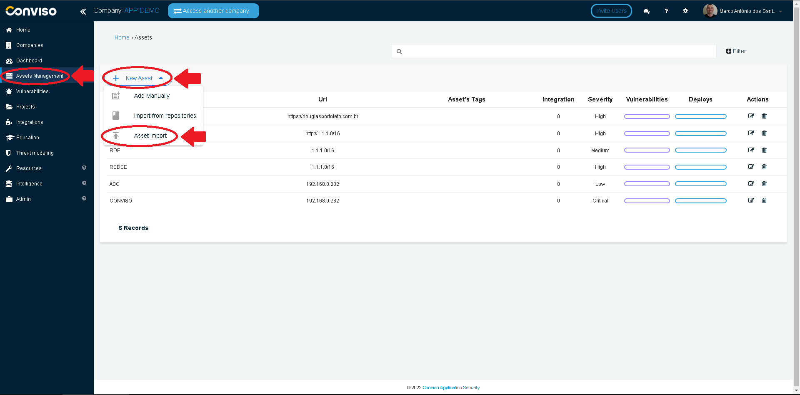
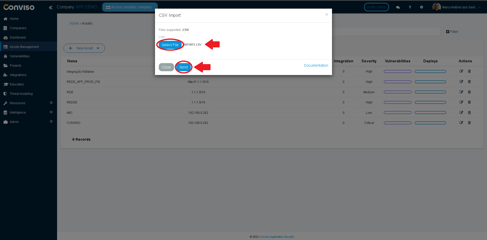

## Introduction

This function allows simultaneous multiple assets creation. Just create a ```.csv``` file with the requested data below. To import asset CSV files, certain rules must be followed before importing into Conviso Platform.

When filling in the CSV file, the values **must be in English and all lowercase**. If you want to leave the field blank, even if it is optional, you must fill it as ```none```.

## CSV file structure

Below there are the column names with the values that must be in the file, as well as the possibilities of the fields to be filled in; otherwise, the assets will not be created automatically.

**```name```**: asset name **(mandatory)**

**```url```**: asset URL (optional)

**```description```**: asset description (optional)

**```technologies```**: ruby, java, php, ruby, jquery, frameworks, mobile, none, etc. (optional)

**```type```**: none, client_server, API, progressive_web_app, web, native_mobile, hybrid_mobile database, dmz, legacy, cluster node (optional)

**```architecture```**: none, monolithic, microservices, serverless (optional)

**```criticity```**: none, critical, high, medium, low (optional)

**```development_team```**: none, internal, external, internal_and_external (optional)

**```development_model```**: none, agile, waterfall, third_party (optional)

**```audience```**: none, internal, external, internal_and_external (optional)

**```teams```**: assigned team for asset access (optional)

**```integrations```**: fortify, nessus, sonarqube, none (optional) 

:::note 
The system integration must exist before filling in the **```integrations```** field
:::

**```data_classification```**: none, public, non-confidential, confidential (optional)

**```environment```**: none, amazon-aws, microsoft-azure, google-cloud, ibm-bluemix, on-premise, another-cloud (optional)

**```life_cycle```**: none, production, homologation, certification, discontinued (optional)

**```tags```**: to assist you when searching (optional)

**```scan_type```**: none, server, container, SAST, DAST (optional)

You may also use this [Template](https://conviso-public-files.s3.amazonaws.com/modelo.csv.zip) to assist you on creating the ```.csv``` file. Below, an example:

<div style={{textAlign: 'center'}}>


</div>

## Importing your Assets CSV file

Log in to the [Conviso Platform](https://app.convisoappsec.com);

On the main menu to the left, click on **Assets Management**. At the panel to the right, click on the **New Asset** button, then select the **Asset Import** option on the drop-down list:

<div style={{textAlign: 'center'}}>



</div>

On the modal shown, browse for your custom ```.csv``` file by clicking on the **Select File** button. When done selecting your ```.csv``` file, click on the **Send** button to start the assets import to the Conviso Platform.

<div style={{textAlign: 'center'}}>



</div>


