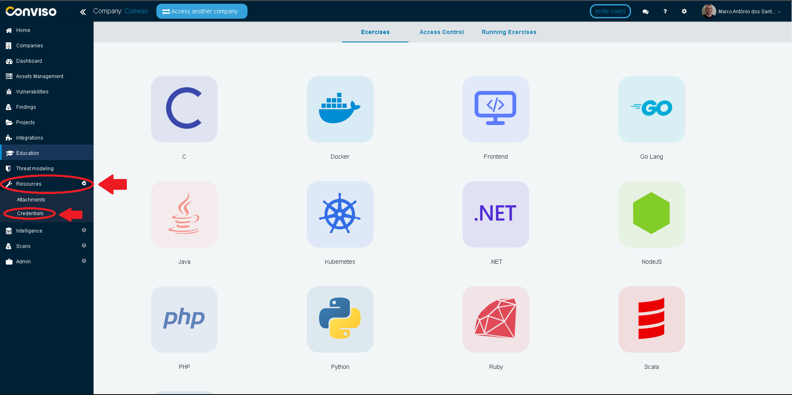
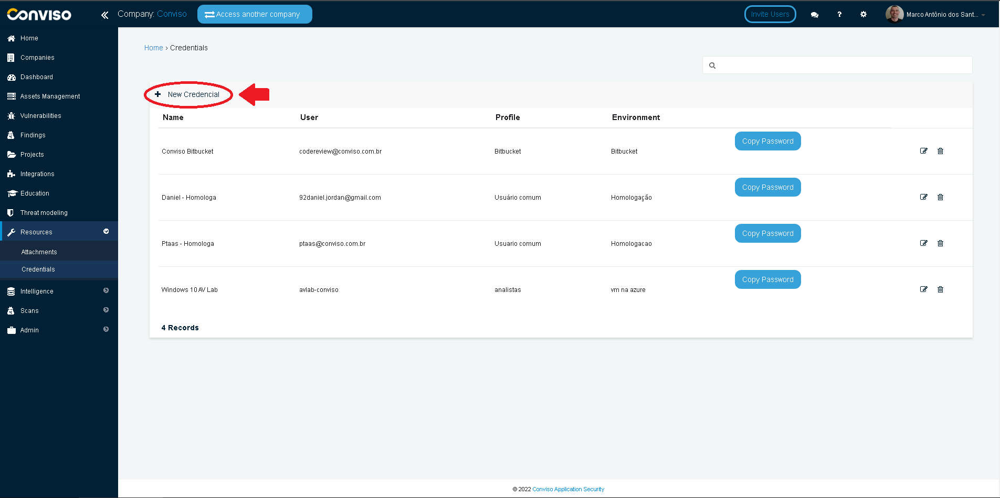
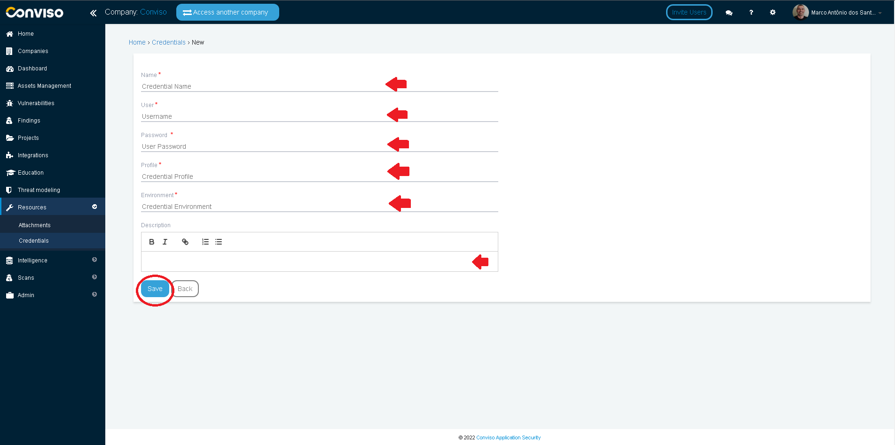
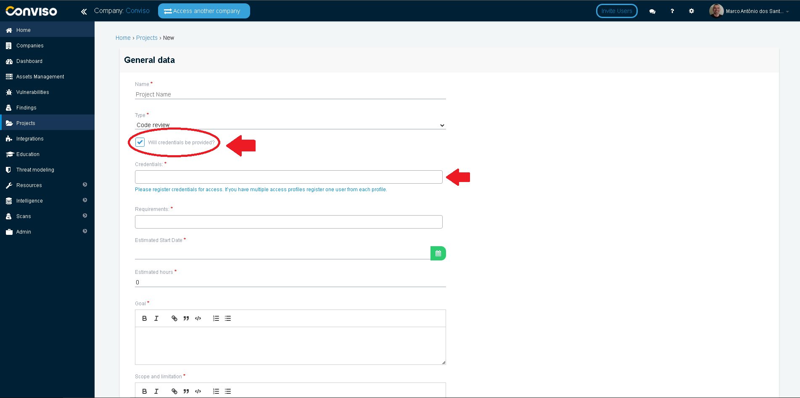
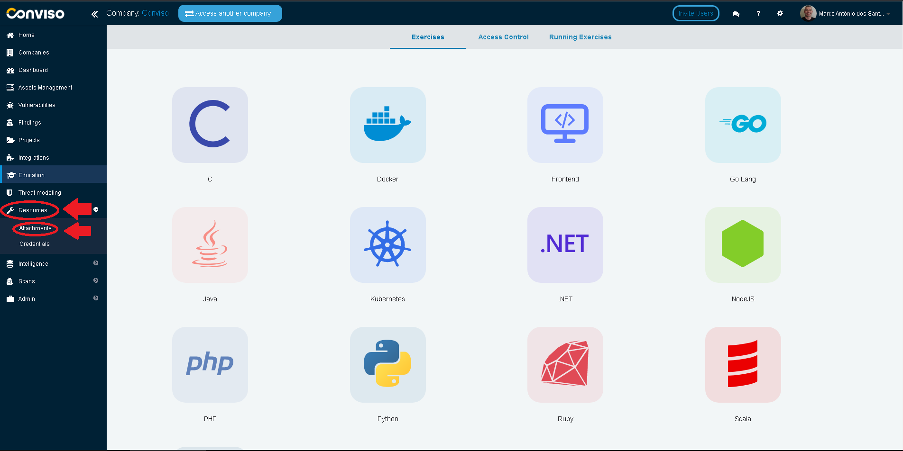
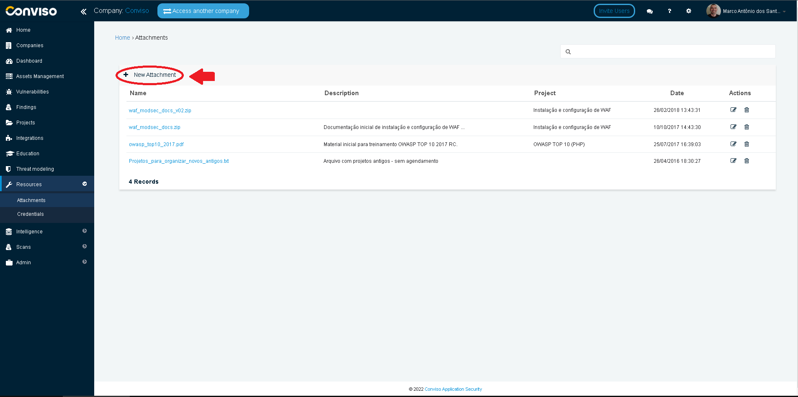
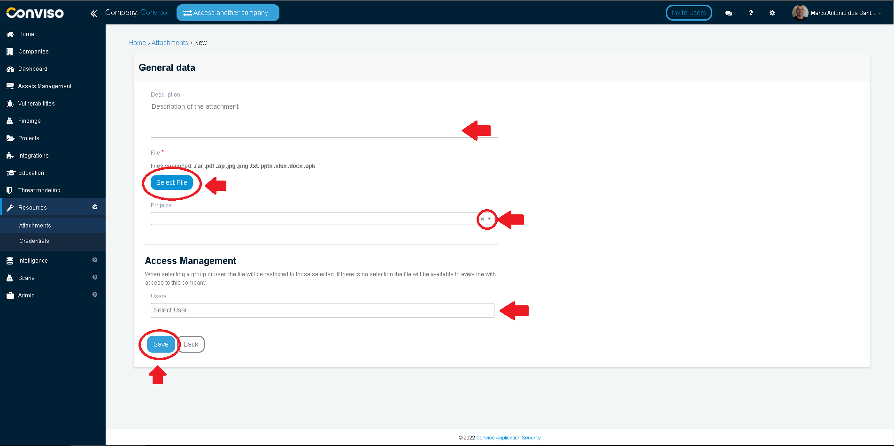

## Introduction

Manage credentials and attached files in Conviso Platform. This feature allows you to register access to the security test environment and if there is documentation such as; topology or architectural design of the environment, we recommend that you use this feature of Conviso Platform.

This ensures control over who should have access to this information, as it is critical information.

## Credentials

To register a credential, on the main left menu click on **Resources** and then on **Credentials**:

Next, click on **New Credential** to start creating your credential:

Fill in the mandatory form fields: 

- **Name**: A label to identify your credential;
- **User**: The username you will use;
- **Password**: The username password;
- **Profile**: The user profile;
- **Environment**: The environment where this credential will be used;

If you wish to better describe you credential purposes, use the optional **Description** text box to set a brief description of your credential. When done filling the form, click on the **Save** button to store your new credential: 

## Using credentials in Projects

To add an existing credential to a new or an existing project, create (or edit) a project.

In the project configuration form, check the option **Will credentials be provided?**, and then select the credential filled in the previous steps in the **Credentials** text box, as shown in the image below. It is possible to fill in more than one credential in this text box:

## Attachments

To register an attachment, on the main left menu click on **Resources** and then on **Attachments**:

Next, click on **New Attachment** to start setting up your file attachment:

Fill the form with proper data:

- **Description**: A brief description of your file attachment (optional);
- **File**: use the **Select File** button to browse for your attachment file. This field is mandatory;
- **Projects**: To share the file attachment you are creating with any project, select the project or projects you want by clicking on the drop-down list;

The **Access Management** section of the form allows you to restrict the file attachment access to one or more users, by selecting them by clicking on the drop-down list **Users**. When done, click on the **Save** button to store your attachment configuration settings:

