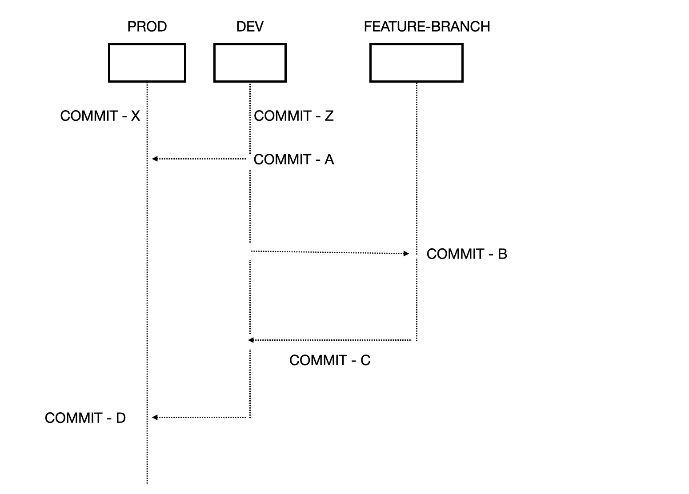

## Introduction
There are three different ways to submit Deploy to Code Review. Before deploying the code to Conviso's security analysts, it is essential to choose among the available strategies the one that best suits the repository.

**With TAGS, sorted by timestamp**

This approach is ideal for projects where there is a single line of releases in development and the previous tags are deprecated. For example, in a fictitious project, the following tags were created:

- 0.1.0, created on 10/10/2017

- 1.0.0, created on 02/01/2018

- 1.1.1, created on 04/01/2018

- 2.0.0, created on 04/02/2019

When deploying in version with tag 2.0.0, the content of the code sent to Conviso will be the diff between versions 2.0.0 and 1.1.1, as the selection was made in chronological order.

**With TAGS, sorted by versioning-style**

Unlike the previous approach, this one is more suitable for more complex versions, where the use of tags is more intense, generally keeping multiple versions in development. For example, in another fictitious project, the tags below were created:

- 0.1.0, created on 10/10/2017

- 1.0.0, created on 02/01/2018

- 1.1.1, created on 04/01/2018

- 2.0.0, created on 04/02/2019

- 1.2.1, created on 04/05/2019

In this scenario, when deploying in the version with tag 1.2.1, the content of the code sent to Conviso will be the diff between versions 1.2.1 and 1.1.1, as the selection was performed by the versioning format.

:::note
In this scenario, if the previous strategy had been selected, the diff performed would be with release 2.0.0, which would be incorrect as it is ahead of the development of 1.2.1.
:::

**Without TAGS, sorted by GIT Tree**

This last approach differs from the other two in that it doesn't use tags, for diff the git timeline itself is used. For example, in a third fictitious project, we have the structures below:

From the above scenario, we can mention some possible deploys:

1. Deploy on feature-branch branch, on commit B: content of the code sent to Conviso will be the diff between commits B and A;

2. Deploy on the dev branch, on commit A: content of the code sent to Conviso will be the diff between commits Z and A;

3. Deploy on the prod branch, on commit D: content of the code sent to Conviso will be the diff between commits D and A;

4. Deploy on the prod branch, on commit A: content of the code sent to Conviso will be the diff between commits X and A;

And so, successively, the policy will diff the current commit with the previous commit of the current branch, respecting the repository tree.

Want to learn more about how to apply these strategies? Follow these links:

- [Jenkins](../integrations/jenkins)
- [Gitlab](../integrations/gitlab)

