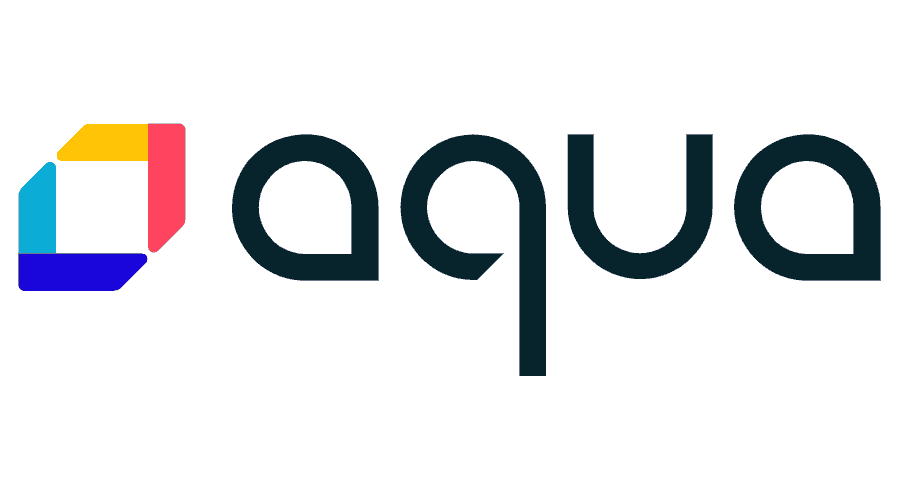
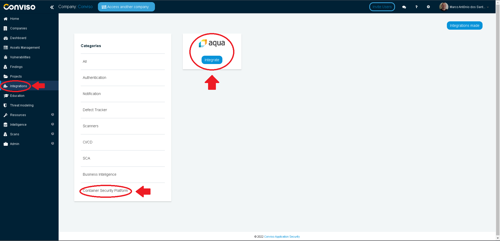
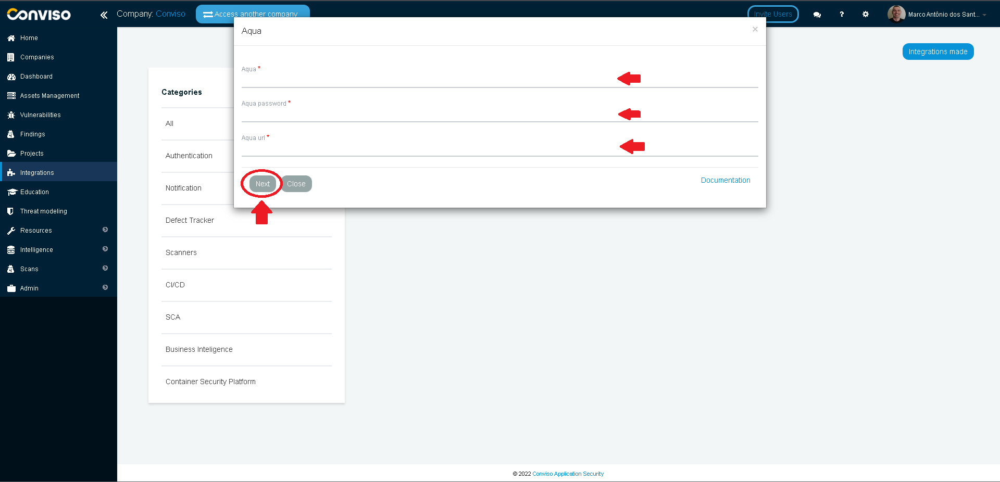
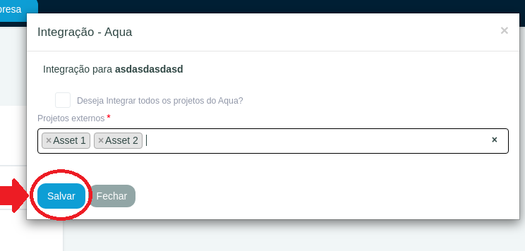

:::note
First time using Aqua? Please refer to the [following documentation](https://www.aquasec.com/resources/).
:::

## Introduction

This integration allows the import of issues (vulnerabilities) found in Aqua to Conviso Platform, allowing the user to take advantage of Conviso Platform's full potential for vulnerability management.

## Requirements

- **Aqua User ID**: The user you will use to log in to your Aqua instance;

- **Aqua User Password**: The corresponding user password you will use to log in to your Aqua instance;

- **Aqua URL**: Your Aqua instance URL.

## Conviso Platform Setup

Log in to the [Conviso Platform](https://app.convisoappsec.com);

On the left Menu, click on **Integrations**, then choose **Container Security Platform** on the right panel menu. Click on the **Integrate** button at the Aqua card to start configuring it:

Fill in the form fields with proper data: Your user ID at the field labeled **Aqua**; the user password at the field **Aqua password** and your Aqua URL instance at the field **Aqua URL**. When done filling the form, click on the button **Next** to continue:

In the new modal opened, you can integrate all of your Aqua projects, by checking the box **Do you want to integrate all Aqua projects?**  or you can choose single projects to integrate, by filling the **External Projects** list. After choosing the projects you want to integrate, click on the **Save** button to store your Aqua integration configuration settings: 

