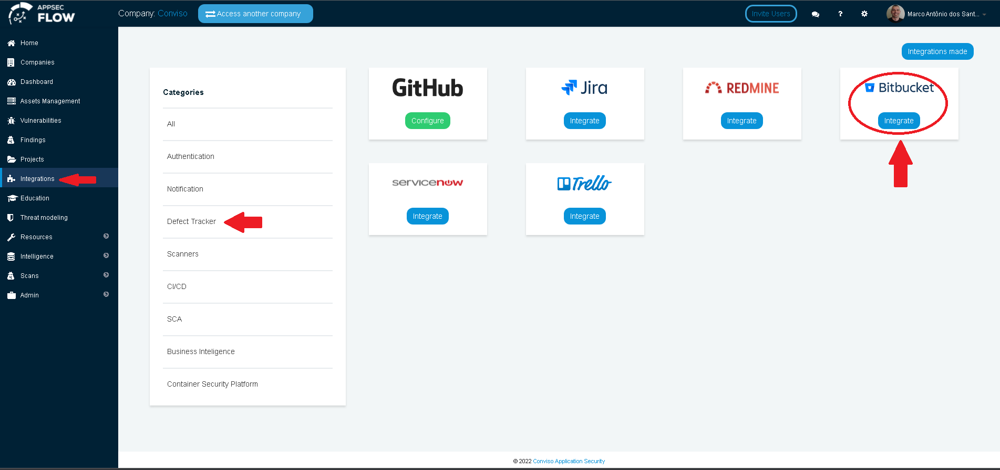
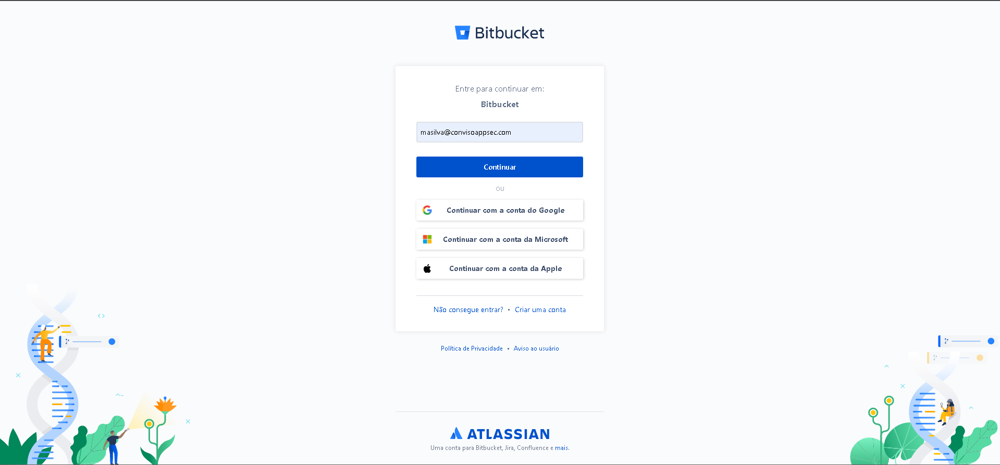
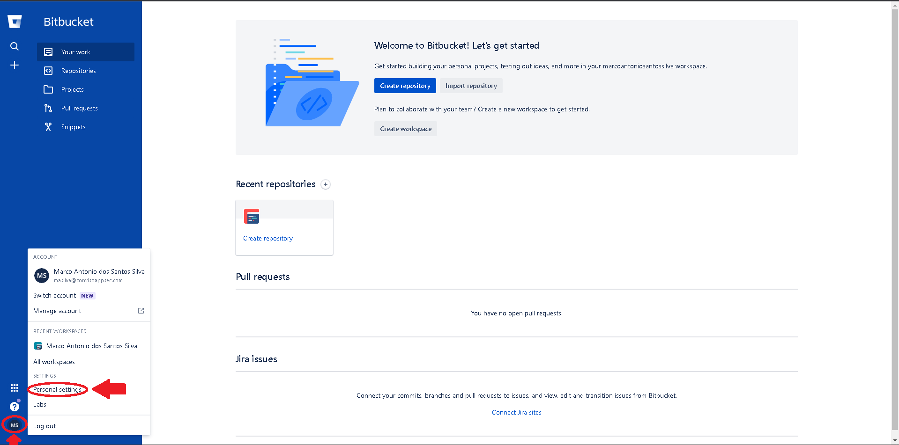
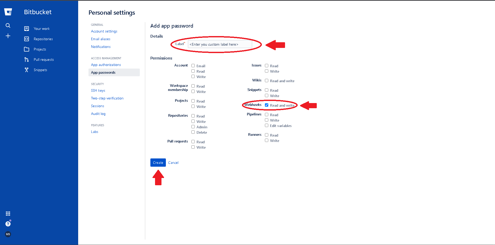
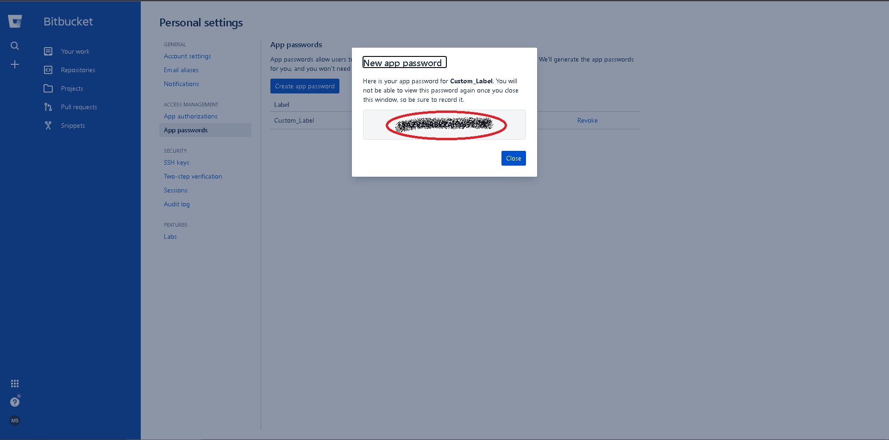

:::note
First time using Bitbucket? Please refer to the [following documentation](https://bitbucket.org/product/guides)
:::

## Introduction

The integration of Conviso Platform with the Bitbucket tool is done via "API", where we connect our product with Bitbucket, allowing the creation of issues, comments, and as well as a webhook for the comments made in the issues.

The integration of Bitbucket with Conviso Platform will benefit the management of issue control and the consolidation of vulnerabilities. With the integration in place, the customer can orchestrate the vulnerability to their tool.

The Conviso Platform has a two-way commnunication with Bitbucket, that is, if a user adds comments in the Bitbucket discussion field, it will generate a notification on the Security Champions tab of the specific vulnerability. This allows a Conviso technician to interact with the development team that is making corrections.

## Integrating Conviso Platform with Bitbucket

In order to perform this integration, you will need:

- Bitbucket username and password;
- Repository name.

Log in to the Conviso Platform. At the left Menu, choose **Integrations**. At the right panel, choose **Defect Tracker**, then click at the button **Integrate** at the Bitbucket card:

After clicking at the Integrate button, you will be redirected to the **Atlassian Bitbucket** login page. Provide your credentials in order to access Bitbucket:

## Bitbucket Webhook Configuration

In order to configure Bitbucket, you must:

- Create an App password;
- Configure the webhook;
- Associate an asset with an integration.

At the Bitbucket dashboard page, click on you **user icon**, then click on **Personal Settings**, as follows:

At the next page, select **App passwords**, then click on the **Create app password** button:

Next, you must provide a **Label** to identify your App password and enable the desired permissions, while it is mandatory that the **Webhooks "Read and Write"** permission is enabled, as shown in the image below. Other permissions are optional for configuring the webhook in Bitbucket. After selecting the desired options, click on the **Create** button to generate your App password: 

Your new **App password** password will be generated. Remember to copy it before clicking on **Close**, otherwise it will be necessary to generate another password, repeating all the processes described in the 2 paragraphs and images above.

