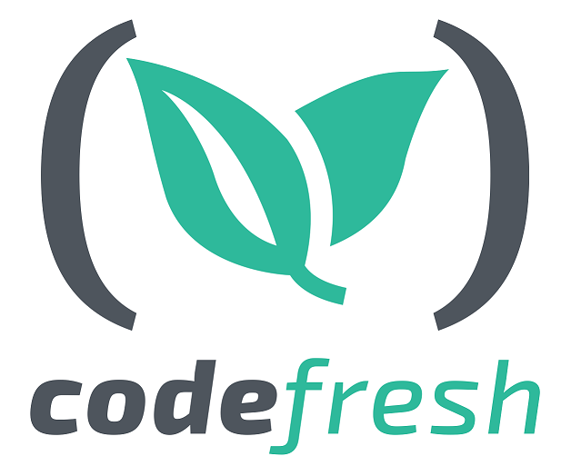

[FlowCLI]:<../cli/installation>



:::note
First time using Codefresh? Please refer to the [following tutorial](https://codefresh.io/docs/).  
:::

## Requirements

Access to docker deamon when running the Pipeline is a must. The Codefresh SaaS version does not provide access to this feature by default. Currently, the integration is only compatible with Hybrid type environments (with runners at the infrastructure itself) or fully on-premise. More information about the Code Fresh installation types can be found at [Codefresh official documentation page](https://codefresh.io/docs/docs/administration/installation-security/).

## First Steps

If you have at least one "CodeFresh Runner" installed at your on-premises infrastructure, you can create the first pipeline by interacting with AppSecFlow's command line tool, [FlowCLI]. If you do not have one yet, it is recommended that you read the [Runner-related page in the official CodeFresh documentation](https://codefresh.io/docs/docs/administration/codefresh-runner/).

Whereas the local Runner is the default Runtime Environment for your CodeFresh account, all pipelines that didn't have this property changed manually will have their builds performed on it. With that in mind, we can proceed to the creation of a first pipeline to better know the tool.


```yml
version: "1.0"
stages:
- "test"
steps:
  flow_sample:
    title: "FlowCLI Hello"
    type: "freestyle"
    image: "convisoappsec/flowcli"
    commands:
      - "flow --help"
    stage: "test"
```

```
Executing command: flow --help
Usage: flow [OPTIONS] COMMAND [ARGS]...
Options:
  -k, --api-key TEXT  The api key to access flow resources. [env var: FLOW_API_KEY]
  -u, --api-url TEXT  The api url to access flow resources. [env var: FLOW_API_URL; default: https://app.conviso.com.br]
  -i, --api-insecure  HTTPS requests to untrusted hosts is enable. [env var: FLOW_API_INSECURE; default: False]
  -h, --help          Show this message and exit.
  -v, --version       Show the version and exit.
Commands:
  deploy
  finding
  sast
Run flow COMMAND --help for more information on a command.
Successfully ran freestyle step: FlowCLI Hello
```

## Variables Setup

### Pipeline Variables Setup

### Account Variables Setup

## Code Review

### Sorted by Time TAGS

```yml
flow_sample:
    title: "FlowCLI Deploy"
    type: "freestyle"
    image: "convisoappsec/flowcli"
    commands:
      - "flow deploy create with tag-tracker sort-by time"
    working_directory: "/codefresh/volume/${{CF_REPO_NAME}}"
```     

### Sorted by Versioning TAGS

```yml
flow_sample:
    title: "FlowCLI Deploy"
    type: "freestyle"
    image: "convisoappsec/flowcli"
    commands:
      - "flow deploy create with tag-tracker sort-by versioning-style"
    working_directory: "/codefresh/volume/${{CF_REPO_NAME}}"
```

### Sorted by GIT Repository

```yml
flow_sample:
    title: "FlowCLI Deploy"
    type: "freestyle"
    image: "convisoappsec/flowcli"
    commands:
      - "flow deploy create with values"
    working_directory: "/codefresh/volume/${{CF_REPO_NAME}}"
```

## SAST

```yml
flow_sample:
    title: "FlowCLI SAST"
    type: "freestyle"
    image: "convisoappsec/flowcli"
    commands:
      - "flow sast run"
    stage: "test"
    working_directory: "/codefresh/volume/${{CF_REPO_NAME}}"
```

```yml
flow_sample:
    title: "FlowCLI SAST"
    type: "freestyle"
    image: "convisoappsec/flowcli"
    commands:
      - "flow sast run --start_commit `git rev-parse @~1` --end-commit $CF_REVISION"
    stage: "test"
    working_directory: "/codefresh/volume/${{CF_REPO_NAME}}"
```

### Gathering Everything: Code Review & SAST Deploy

```yml
flow_sample:
    title: "FlowCLI SAST"
    type: "freestyle"
    image: "convisoappsec/flowcli"
    commands:
      - "flow deploy create -f env_vars with values > created_deploy_vars"
      - "source created_deploy_vars"
      - "flow sast run --start-commit \"$FLOW_DEPLOY_PREVIOUS_VERSION_COMMIT\" --end-commit \"$FLOW_DEPLOY_CURRENT_VERSION_COMMIT\""
    stage: "test"
    working_directory: "/codefresh/volume/${{CF_REPO_NAME}}"
```