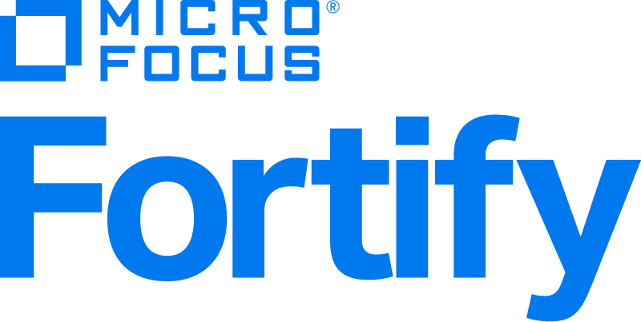
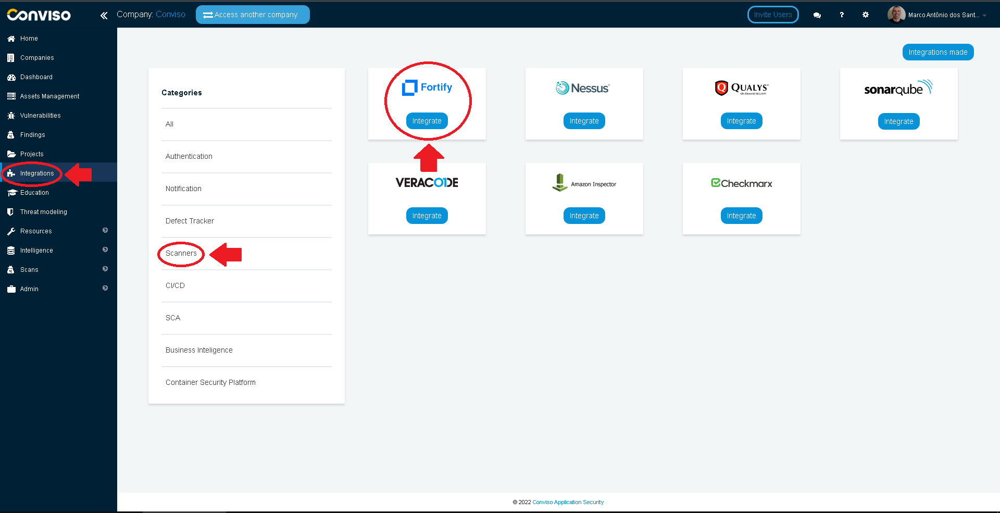
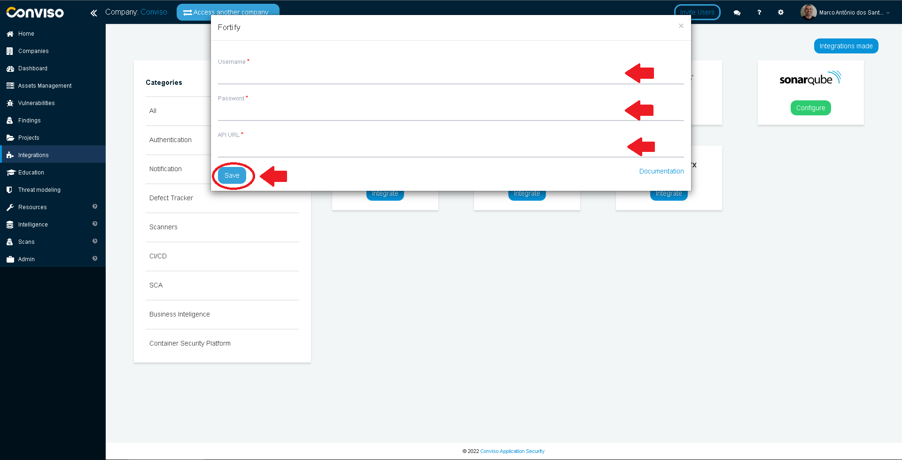
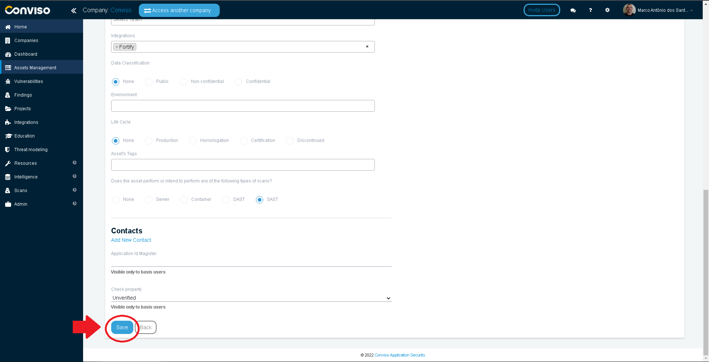
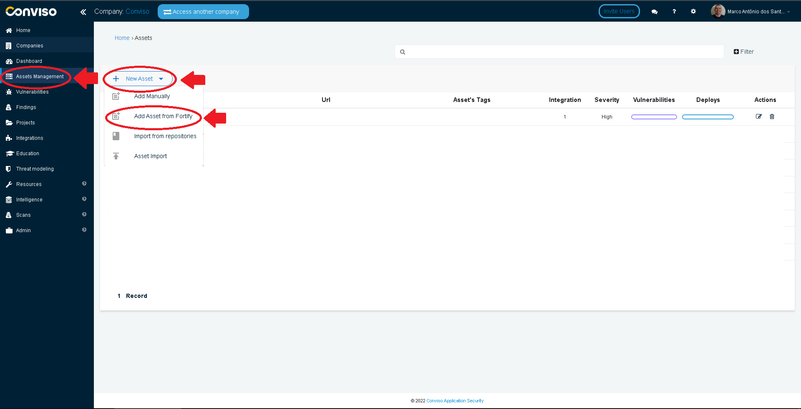
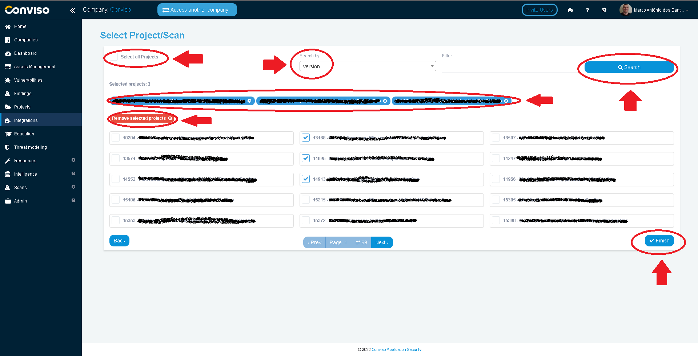

<div style={{textAlign: 'center'}}>



</div>

:::note
First time using Fortify? Please refer to the [following documentation](https://www.microfocus.com/pt-br/documentation/fortify-software-security-center/).
:::

## Introduction

This integration allows the import of issues (vulnerabilities) found in Fortify automatically to Conviso Platform, allowing the user to take advantage of Conviso Platform full potential for vulnerability management.

## Requirements

To integrate Fortify with Conviso Platform, you will need the following data:

- Username: Credential of a Fortify user with admin privilege;

- Password: The password of the referred username;

- API URL: The API URL address obtained from Fortify subscription, e.g. ```192.168.1.15/ssc/api/v1```.

## Conviso Platform Setup

Log in to the [Conviso Platform](https://app.convisoappsec.com);

On the main menu to the left, click on **Integrations**. At the panel to the right, click on the **Scanners** option, then click on the **Integrate** button on the **Fortify** card:

<div style={{textAlign: 'center'}}>



</div>

Fill the **Username**, **Password** and **API URL** with the required data. When done filling all the required fields, click on the **Save** button to store your Fortify integration configuration settings:

<div style={{textAlign: 'center'}}>



</div>

## Existing Assets Setup

On the left Menu, click on **Assets Management**, then click on the **Edit** icon to the right of the asset you want to integrate, at the column **Actions**:

<div style={{textAlign: 'center'}}>


</div>

Click on the **Advanced** button to expand all the asset's properties:

<div style={{textAlign: 'center'}}>


</div>

On the **Integrations** section, type ```Fortify``` and then use TAB to create the tag:

<div style={{textAlign: 'center'}}>


</div>

At the end of the form, click on the **Save** button to store your integration configuration settings:

<div style={{textAlign: 'center'}}>



</div>

## Importing Fortify Projects

You may want to create assets directly form Fortify. To do this, click on **Assets Management** on the left menu, then click on the drop-down list **+ New Asset** and choose the option **Add Asset from Fortify**:

<div style={{textAlign: 'center'}}>



</div>

You can import all of your Fortify's Projects to Conviso Platform by checking **Select All Projects**, or you may want to select individual Fortify projects, by selecting each on individually:

<div style={{textAlign: 'center'}}>


</div>

No matter your choice, once the projects are selected, they will be shown as a list below the section **Selected Projects**. You may want to search for a particular project by **Project Name** or **Version** using the **Search** button. Also, you can remove all the selected projects by clicking on the **Remove Selected Projects**, if you have selected any projects by mistake. When done selecting the Fortify Projects you want to import to Conviso Platform, click on the button **Finish** to store your integration configuration settings:

<div style={{textAlign: 'center'}}>



</div>