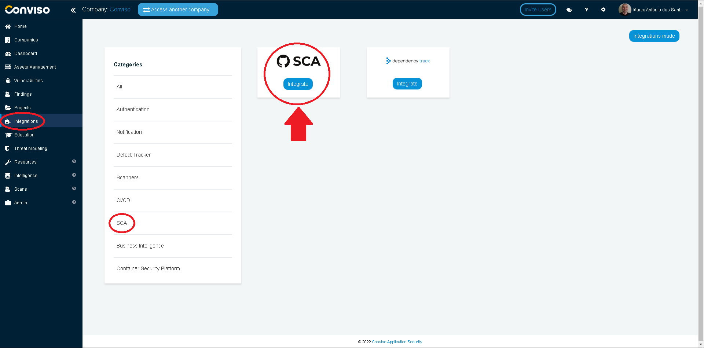

:::note
First time using GitHub SCA? Please refer to the [following documentation](https://docs.github.com/en/code-security/code-scanning/automatically-scanning-your-code-for-vulnerabilities-and-errors/configuring-code-scanning).
:::

## Requirements

In order to integrate GitHub SCA to Conviso Platform, we will need the following data:

- GitHub token;

- GitHub Repository Name;

- A Conviso Platform SCA Project.

## GitHub Setup

In order to get your GitHub token, please refer to [this guide](https://docs.github.com/en/authentication/keeping-your-account-and-data-secure/creating-a-personal-access-token).

### Dependabot

Check if Dependabot is enabled on the project you will integrate. To do this, open the project in GitHub and go to **Security** > **Dependabot Alerts**, and if it’s disabled, 
go to **Settings** > **Code security and analysis** > **Dependabot alerts** > **Enable** to turn it on.

## Conviso Platform Setup

Log in to the [Conviso Platform](https://app.convisoappsec.com);

On the main menu to the left, click on **Integrations**. At the panel to the right, click on the **Scanners** option, then click on the **Integrate** button on the **GitHub SCA** card:

Fill the modal with the **GitHub authorization token** and the **GitHub repository** obtained from GitHub. Also, select the Conviso Platform SCA **Projects** you wish to integrate (if you do not have an SCA Project yet, you may use the **Create** link to create a new one). When done filling the form, click on the **Save** button to store your integration configuration settings:

