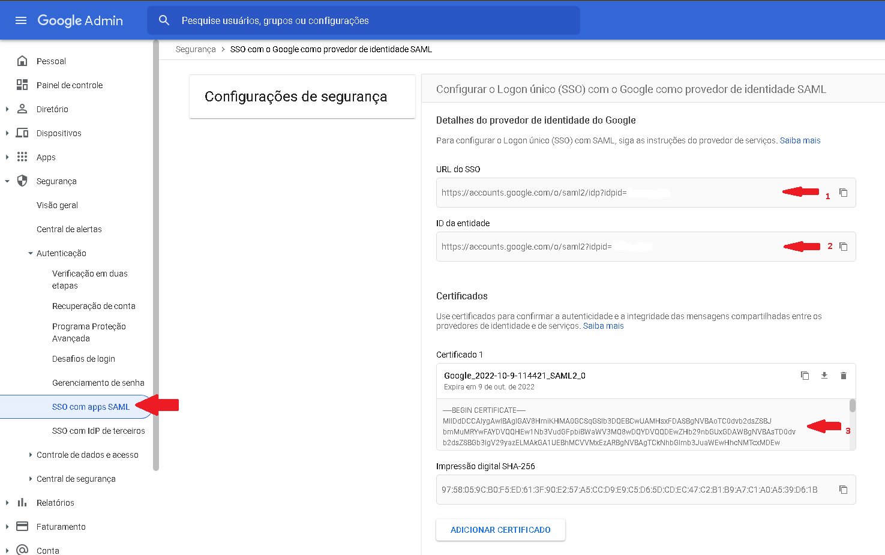
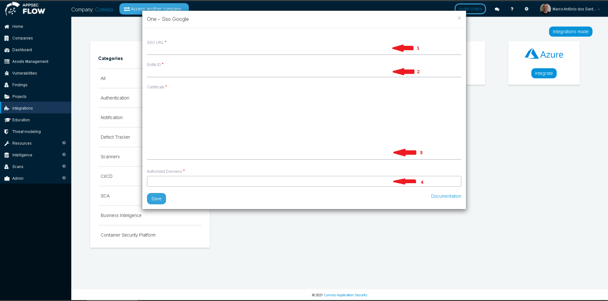
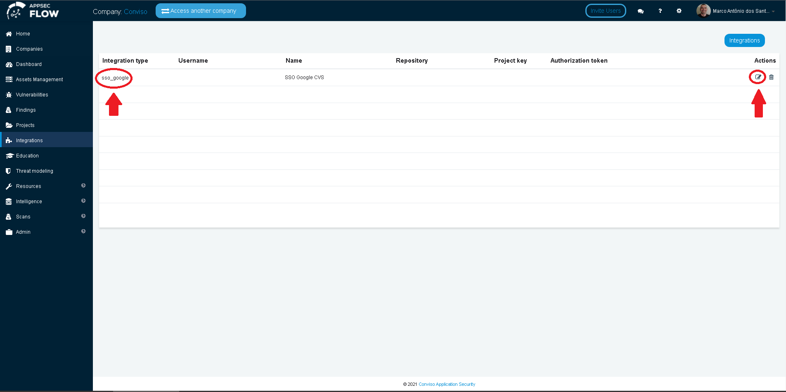
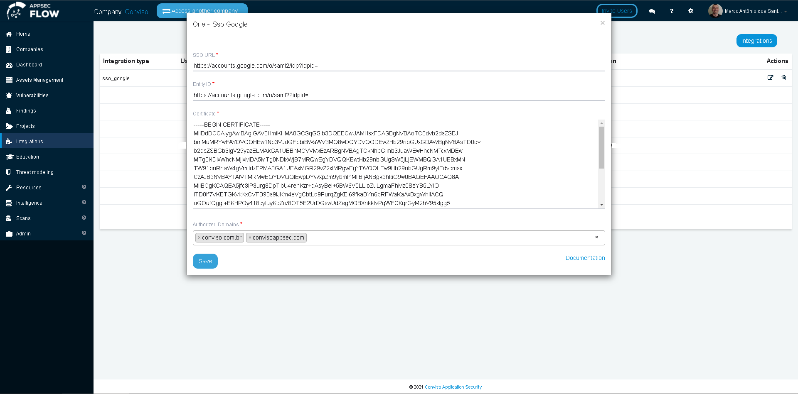

## Introduction

The Google SSO (Single Sign-On) integration aims to increase user security on the platform. With this SSO feature, managers will have full control of who should have access to the Conviso Platform. The impact will be positive for your company's support teams tasks, reducing common “forgot my password” calls by employees, customers and suppliers, allowing the process to flow more quickly.

Benefits:

- Authenticate using corporate email;

- User control.

## SSO Setup

:::note
In order to configure Google SSO, it is necessary to have Admin privileges on the Google Workspaces.
:::

1. On the left menu at the main **Google Admin Console**, go to **Security**, then **Authentication** and then **SSO with SAML Apps**. Leave this screen opened;

2. Log on to **Conviso Platform**. Make sure your **Company** is selected at the upper blue bar, select **Integrations** on the left menu and then select **Authentication** on **Categories** panel:

3. At the right panel, find the Google card and click on **Configure**:

4. The following floating screen will open. Copy the matching fields obtained from **Google Workspaces** to the corresponding fields at this screen. First, the **SSO URL**. Next, the **Entity ID** and, then, the **Certificate**. Finally, fill the **Authorized Domains** field with all your domain name and aliases, if they exist:

5. At last, click Save to store your Google SSO integration configuration.  

## Verifying Google SSO Integration

To check if everything is correct, you may click **Integrations**, then **Authentication** and then **Integrations Made**:

Select the integration you want to view and click at the icon **Edit** on the column **Actions**:

Check if everything is OK. Make changes if needed and click close to leave this screen without saving it or click the button **Save** to store the modified configuration.

## Post-configuration Actions

In order to change the authentication type in Conviso Platform, we must go to the **Integrations** screen and click on **Authentication**.

Click the button below the Conviso icon to change the authentication type from SSO (Disabled) to Default Login and Password (Enabled), or vice-versa:

If **Disabled**, login will be done via SSO. When **Enabled**, the login and password will be used to access Conviso Platform.

:::note
 In order to disable the login and password option, we must have an SSO integration already configured.
:::