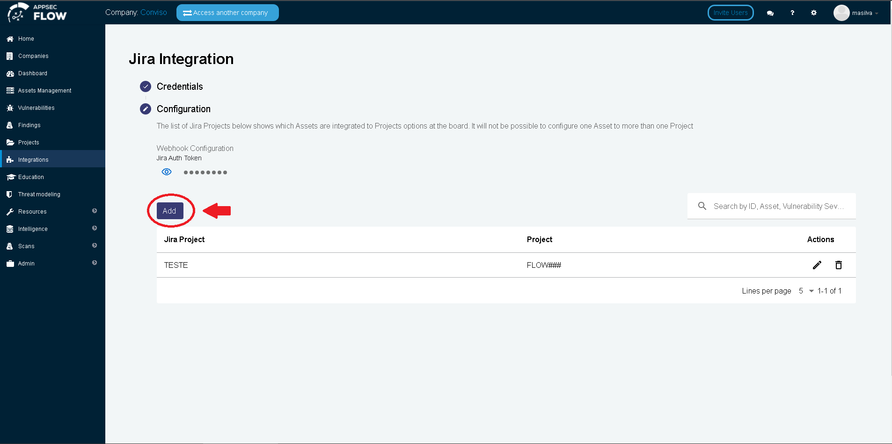
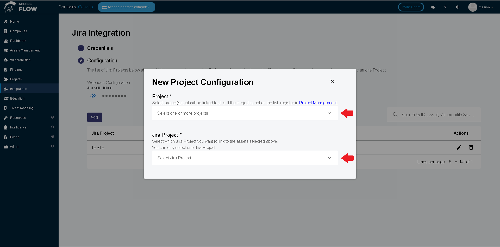
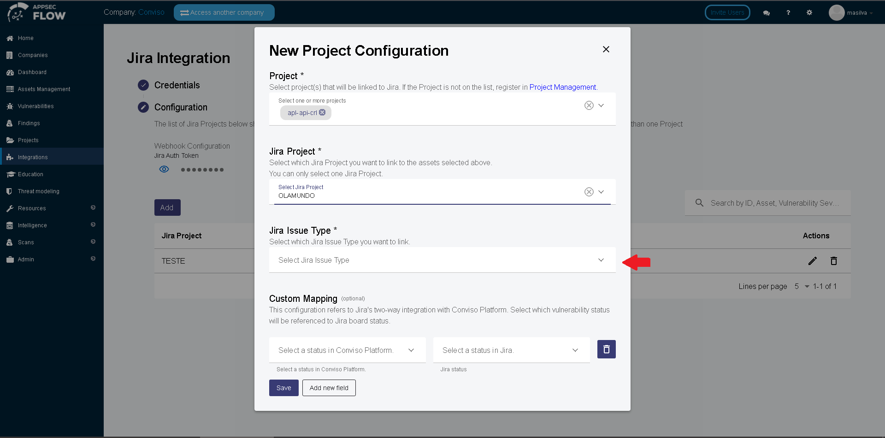
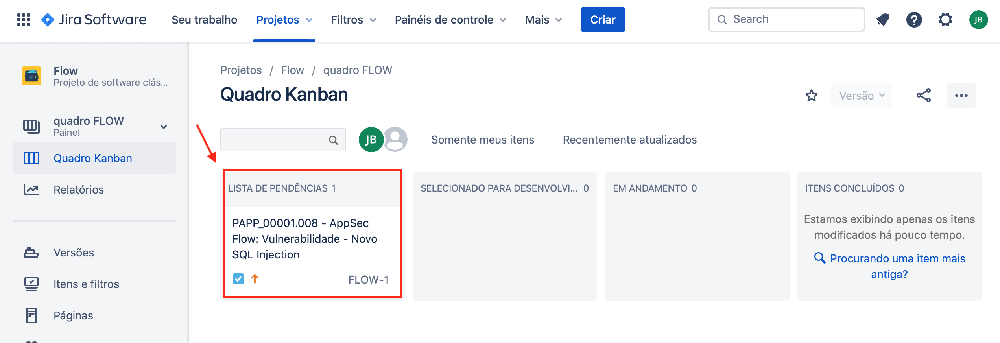
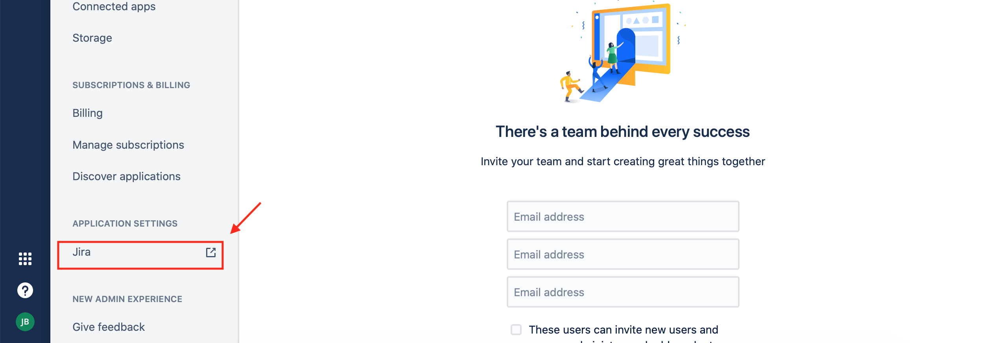
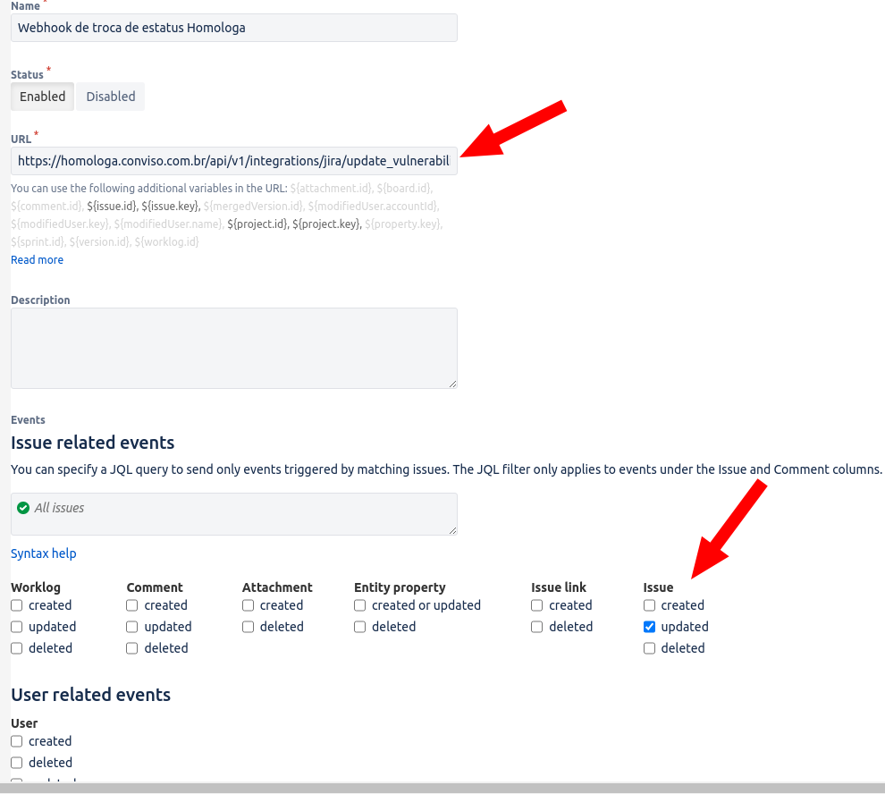
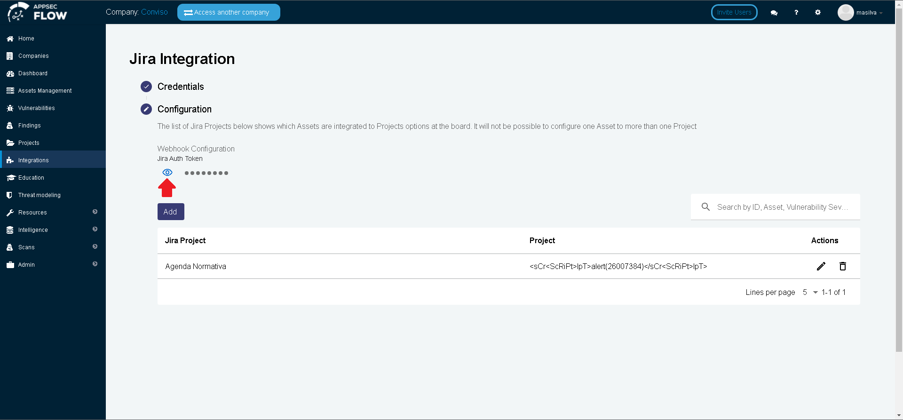
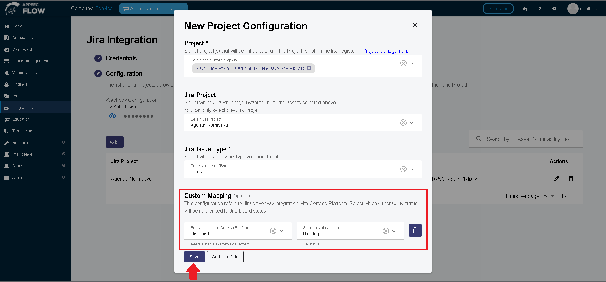

<div style={{textAlign: 'center'}}>


</div>

:::note
First time using Jira? Please refer to the [following documentation](https://www.atlassian.com/software/jira/guides).  
:::

## Introduction

The integration of the Conviso Platform with the Jira tool is done via API where we connect our product with Jira, which allows the creation of issues, comments, and as well as a Webhook for comments made on an issue.

Jira's integration with Conviso Platform will benefit issue control management and vulnerability consolidation. With the integration performed, the customer can orchestrate vulnerability to Jira.

The Conviso Platform communication with Jira is bidirectional, that is, if a user adds comments in the Jira discussion field, the added message will automatically appear on the vulnerability's Security Champions tab. This allows a Conviso technician to interact with the development team that is doing corrections.

## Requirements

To perform the integration, we will need 3 pieces of information:

1. Jira's website address;

2. Email or Username;

3. Token API.

## Integration Setup

First let's access Jira and copy the URL, as shown in the image below:

<div style={{textAlign: 'center'}}>


</div>

Then, to generate the **API Token**, access the following link: [API - TOKEN](https://id.atlassian.com/manage-profile/security/api-tokens):

<div style={{textAlign: 'center'}}>


</div>

After clicking the create API token button, as shown in the image above, copy the API key, as shown in the image below:

<div style={{textAlign: 'center'}}>


</div>

The next step within Jira is to copy the project key that should receive Conviso Platform issues. Look for the **Settings** button and then the Key option, as shown in the image below:


<div style={{textAlign: 'center'}}>


</div>

Now that we have the necessary information, let's go to Conviso Platform, look for the Integrations menu on the left side, and finally the Integrate button just below Jira, as illustrated in the example image below:


<div style={{textAlign: 'center'}}>


</div>

Then, all Jira information must be filled in the fields requested by Flow, and that were demonstrated how to obtain at the beginning of this document.

The checkbox **Jira SSL?** must be checked only if the certificate associated with Jira is issued by a Public Certificate Authority. For Private CAs aor self-signed certificates, use https:// at the site address URL and leave this box unchecked.

<div style={{textAlign: 'center'}}>


</div>

After saving the integration, click on the Configure button right under Jira, so we can choose which projects will be added to the integration.

<div style={{textAlign: 'center'}}>



</div>

In **Associated Projects**, you will have 3 fields that you need to configure initially:

1. **External projects**: These are Jira projects that you want to integrate with Flow. Required field;

2. **Project**: These are the Conviso Platform Projects that you want to integrate with the Jira project mentioned above. Required field;

3. **Type of issue**: Select the type of activity to help better understand the project, for example: improvement, bug, priority, etc. Required field;

4. **Subtask Key**: If you select the Issue type as Subtask, an additional field will appear to be filled, which will be the Subtask Key. In this case, it will be filled with the Task Parent key (above the Subtask). Required field.

<div style={{textAlign: 'center'}}>



</div>

If your Jira has custom fields, they must be filled in. In order to include them, first it is necessary to click on **Add Custom Fields**, where the options below will appear:

<div style={{textAlign: 'center'}}>



</div>

- **Custom Fields**: Select the corresponding custom field from your Jira.

- **Field Type**: Specify the type corresponding to the custom field. Some of the field types can be:

```yml
array: a pre-selected numeric field from a pre-established array
```

```yml
string: a string of characters that can contain letters and numbers
```

```yml
number: a string containing only numbers
```

```yml
date: a string containing only numbers representing the date
```

```yml
datetime: a string containing only numbers representing the date and time
```

```yml
custom: a customizable value field in Jira
```

- **Custom Field Value**: Specify the value to be filled in the custom field.

To see which customizable fields your Jira supports, copy and paste the field below into a tab of your browser, replacing the beginning with your Jira URL that is built into Flow:

```yml
[Paste your Jira URL here]/secure/admin/ViewIssueFields.jspa?start=0&searchFilter=&returnUrl=ViewIssueFields.jspa%3Fstart%3D0%26searchFilter%3D 
```

To find out if your Jira integration with Conviso Platform is working correctly, just click the Test Integration button, as shown in the image below:

<div style={{textAlign: 'center'}}>


</div>

Whenever a new vulnerability is identified, it is automatically sent to the project in Jira, as shown in the image below:

<div style={{textAlign: 'center'}}>



</div>

## Webhooks

You may configure **Webhooks** in order to make the communication with Jira bidirectional. 
:::note
The Webhook function works with Jira version 7.1 and above.
:::

The integration of the WebHook type with Jira allows all comments made on Jira issues to also be registered in Conviso Platform. To start configuring a WebHook, it is initially necessary to obtain an external access code that will be used in the Conviso Platform application.

Initially, you must access the Login page with your username and password and on the right side of the screen click on the Settings icon (User Management), follow the example below:

<div style={{textAlign: 'center'}}>


</div>

Then, click on the Jira icon:

<div style={{textAlign: 'center'}}>



</div>

In the menu on the left, look for Webhooks and then click on the **Create a webhook** button, as shown in the image below:

<div style={{textAlign: 'center'}}>


</div>

When clicking on the button to create a Webhook, we must use this URL and at the end put the token generated by the integration inside Conviso Platform:

```yml
https://app.conviso.com.br/payload?issue_id=${issue.id}&issue_key=${issue.key}&project_id=${project.id}&project_key=${project.key}&jira_authorization_token=SEU_JIRA_TOKEN
```

In order to copy the token generated in the integration, access Conviso Platform and then click Configure:

<div style={{textAlign: 'center'}}>


</div>

Now we have to add the token at the end of the URL. It will look like this:

```yml
https://app.conviso.com.br/payload?issue_id=${issue.id}&issue_key=${issue.key}&project_id=${project.id}&project_key=${project.key}&jira_authorization_token=SEU_JIRA_TOKEN
```

In the URL field, we add the link with the token, as follows in the example below:

<div style={{textAlign: 'center'}}>


</div>

Activate the comment event and click on create to finish the Webhook integration:

<div style={{textAlign: 'center'}}>


</div>

By carrying out this process, we can add comments on the Security Champions tab of vulnerability or add the comment directly to the issue created in Jira:

<div style={{textAlign: 'center'}}>


</div>

The comments will appear in Jira's comment field, as shown in the image below:

<div style={{textAlign: 'center'}}>


</div>

## Mapping External Fields to Conviso Platform

:::note
In order to use this feature, your Jira must be configured in English.
:::

This functionality allows vulnerabilities in Conviso Platform to have their status synchronized with jira and vice versa.
To enable it, we need to register a webhook in Jira that allows us to send some data when a Task is modified.
Ee will register a new webhook in the same webhooks registration screen shown in the section above. 


<div style={{textAlign: 'center'}}>



</div>

In the URL field, we put a predefined URL, with its token at the end:

```yml
https://app.conviso.com.br/api/v1/integrations/jira/update_vulnerability?issue_key=${issue.key}&project_key=${project.key}&jira_authorization_token=SEU TOKEN
```

Your token is found in Conviso Platform at Jira integration, as shown below:

<div style={{textAlign: 'center'}}>



</div>

After that, just choose the fields and their respective fields in Jira:

<div style={{textAlign: 'center'}}>



</div>

- **Field in Conviso Platform** - are current statuses that each vulnerability can have in AppsecFlow.

- **External field** - are current status that each task in jira can have.

In the example picture, when we change Conviso Platform to **False Positive** in Jira it will change to **Done** and vice versa; when we change to **Done** in Jira it will change to **False Positive** at Conviso Platform.

:::note
Don't forget to click SAVE after configuring!!!
:::