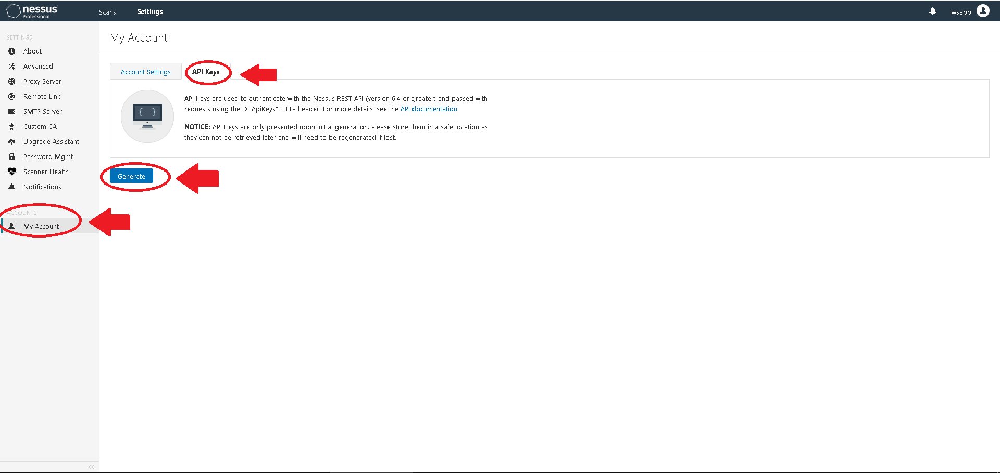
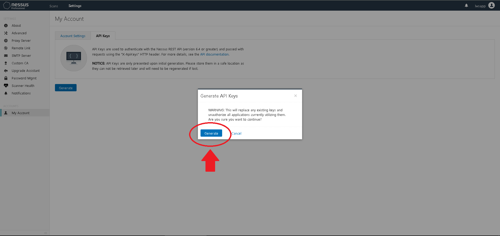
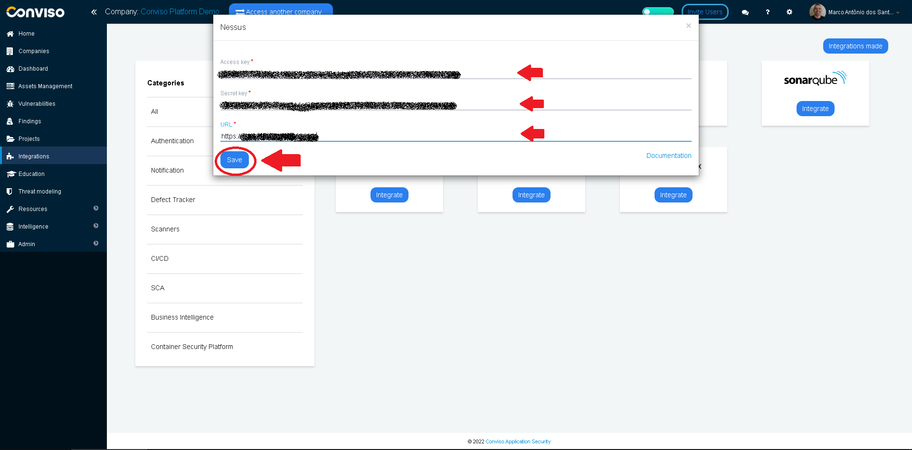

<div style={{textAlign: 'center'}}>


</div>

:::note
First time using Nessus Professional? Please refer to the [following documentation](https://docs.tenable.com/Nessus.htm)
:::

## Introduction

Consolidate vulnerabilities: From a single console you can consolidate and apply analysis of vulnerabilities identified by scan and develop action plans for the treatment of those vulnerabilities.

This integration allows the import of issues (vulnerabilities) found in Nessus to Conviso Platform, allowing the user to take advantage of Conviso Platform full potential for vulnerability management.

## Requirements

In order to integrate Nessus to Conviso Platform, you will need the following data from Nessus Professional:

- A Nessus instance URL that is accessible from Conviso Platform;

- Nessus Access Key;

- Nessus Secret Key.

## Obtaining Nessus Data

Login to your Nessus Professional instance. Take note of the URL at the address bar of your browser, it may looks like ```https://<Nessus_FQDN_or_IP>:<Nessus_Port>```;

At the Nessus Console, click on the **Settings** option, at the top bar menu:

<div style={{textAlign: 'center'}}>


</div>

On the menu to the left, click on **My Account**, at the **Accounts** section. Click on the **API Keys** tab on the right panel, then click on the **Generate** button:

<div style={{textAlign: 'center'}}>



</div>

Click on the button **Generate**, on the Warning window shown: 

<div style={{textAlign: 'center'}}>



</div>

Copy the **Access Key** and the **Secret Key** strings and store them in a safe place. We will use these tokens later.

:::note
These keys are recoverable only once. If you leave this page without copying them, you will need to generate a new token pair!!!
::: 

<div style={{textAlign: 'center'}}>


</div>

## Conviso Platform Setup

Log in to the [Conviso Platform](https://app.convisoappsec.com);

On the main menu to the left, click on **Integrations**. At the panel to the right, click on the **Scanners** option, then click on the **Integrate** button on the **Nessus** card:

<div style={{textAlign: 'center'}}>


</div>

Fill the **Access Key**, **Secret Key** and **URL** with data retrieved from your Nessus instance. When done filling the form, click on the **Save** button to store your integration configuration setting:

<div style={{textAlign: 'center'}}>



</div>

