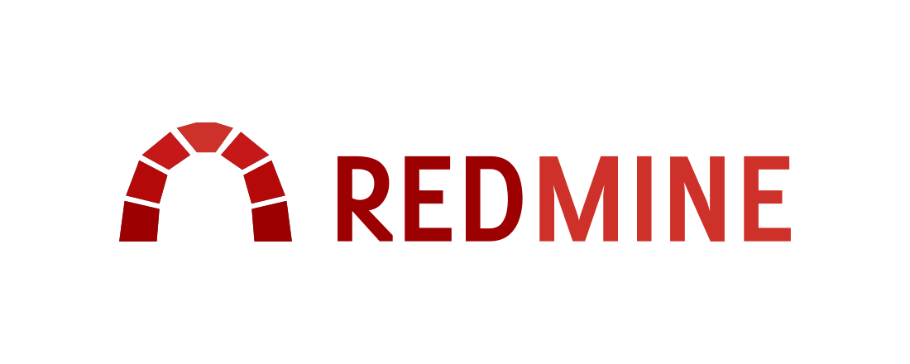
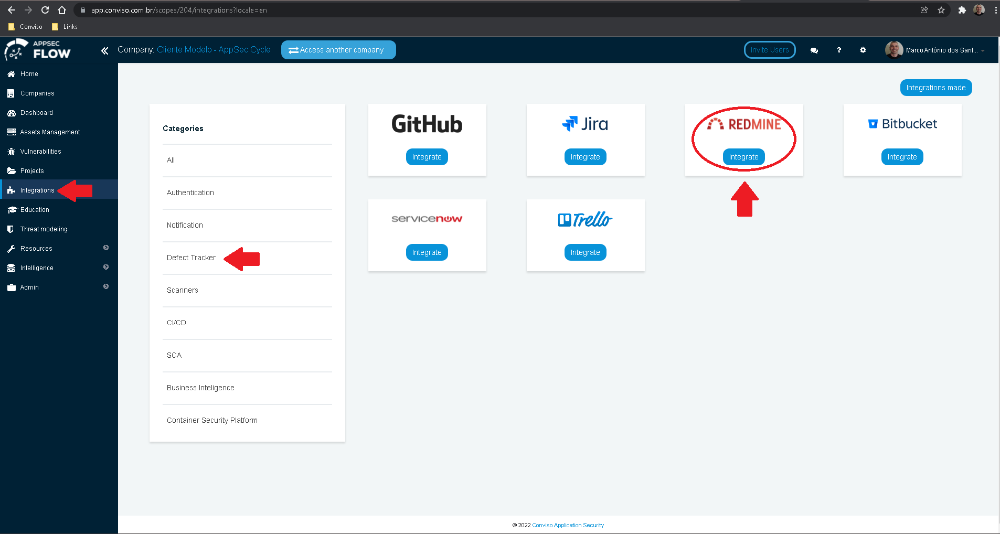
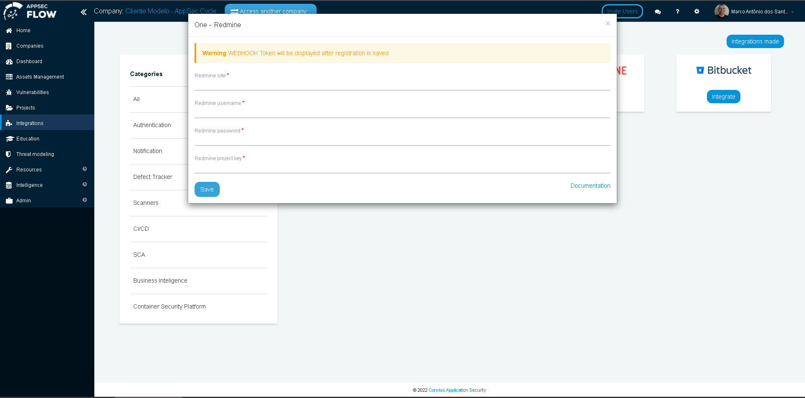
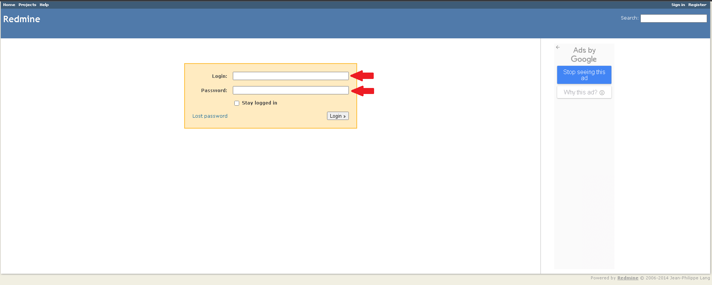
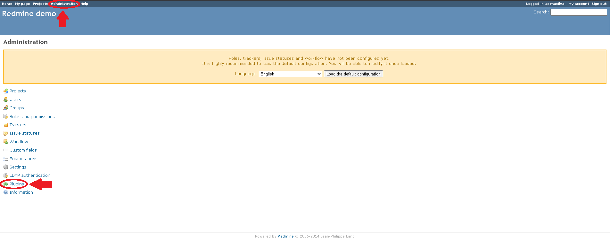
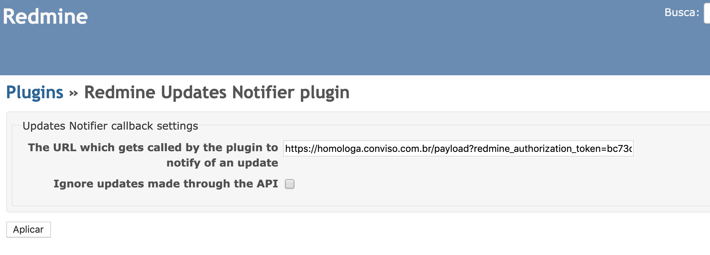

<div style={{textAlign: 'center'}}>



</div>

## Introduction

The integration of Conviso Platform with Redmine is done through an **API**, where we connect our product with Redmine, which allows the creation of issues, comments, and as well as a webhook for comments made in an issue.

Redmine's integration with Conviso Platform will benefit issue control management and vulnerability consolidation. With the integration performed, the customer can orchestrate vulnerability to Redmine.

Conviso Platform and Redmine have a two-way communication, that is, if a user adds comments in the Redmine discussion field, the added message will automatically appear in the Security Champions tab of the vulnerability. This allows a Conviso technician to interact with the development team that is making corrections.

## Requirements

- Repository Address: This field identifies the address of your repository at Redmine;

- Redmine User: Your Redmine user;

- Redmine Password: Your Redmine password;

- Project identification in the Repository: Each Project has an identifier at Redmine.

The Redmine integration has three steps:

- Conviso Platform configuration;

- Redmine webhook configuration;

- Enabling Conviso Platform integration.

## Conviso Platform Configuration

Log in to the [Conviso Platform](https://app.convisoappsec.com);

At the left Menu, choose **Integrations**. At the right panel, choose **Defect Tracker**, then click at the button **Integrate** on the Redmine card:

<div style={{textAlign: 'center'}}>



</div>

A new floating window will be shown, like the following example:

<div style={{textAlign: 'center'}}>



</div>

Fill the form with the required information and then click at the **Save** button. The system will return a notice of Integration done successfully, or it will return an error to be fixed.

## Redmine Webhook Configuration

The WebHook integration with Redmine allows all comments made on Redmine issues to also be registered in Conviso Platform. To start configuring a Webhook it is necessary to install the Redmine Updates Notifier plugin.

First, the user must log in to Redmine:

<div style={{textAlign: 'center'}}>



</div>

Next, at the top menu bar, click on **Administration**. At the **Administration** left menu, click on **Plugins**:

<div style={{textAlign: 'center'}}>



</div>

The installed plugins will be shown in a new window. The **Redmine Updates Notifier** plugin should be displayed:

<div style={{textAlign: 'center'}}>


</div>

By clicking on the **Configure** link on the **Redmine Updates Notifier** plugin section, the user will be taken to a new WebHooks configuration page.

On the **WebHooks System** screen, the user will fill in the form at the field **The URL which gets called by the plugin to notify of an update** with the URL, so the Conviso Platform can receive the actions that took place in the repository.

The user must fill in the URL informing the token already obtained:

```https://app.convisoappsec.com/payload?redmine_authorization_token=<TYPE_YOUR_REDMINE_TOKEN_HERE>```

<div style={{textAlign: 'center'}}>



</div>

To finish the webhook configuration, click at the **Apply** button at the end of the form:

<div style={{textAlign: 'center'}}>


</div>

## Enabling Conviso Platform Integration

After done configuring Redmine Webhook, we need to associate one or more assets with the Redmine integration. Go to **Assets Management** on the left Menu at Conviso Platform, identify the asset that should be associated in the integration and click on edit, following the example below:

<div style={{textAlign: 'center'}}>


</div>

After clicking on edit, look for the field **Integrations**. Type **Redmine** to search for the integration. When done editing this form, click at the **Save** button to store your new integration configuration.

<div style={{textAlign: 'center'}}>


</div>