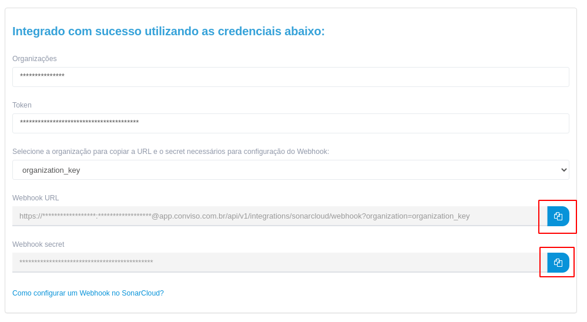
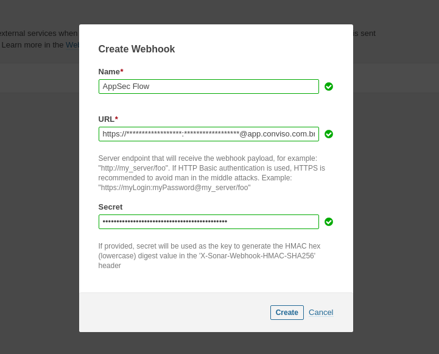

<div style={{textAlign: 'center'}}>


</div>

:::note
First time using SonarCloud? Please refer to the [following documentation](https://sonarcloud.io/documentation).
:::

## Introduction

Are you ready to consolidate yours results and take decisions using just one platform? 
Conviso Platform helps you solve this problem by integrating plenty of scanners and consolidate the results in order to assess, prioritize and manage everything in just a few clicks. The SonarCloud integration does not manage code quality issues, but it does disclose security issues.

After this tutorial you will be able to:
- Import your SonarCloud projects inside Conviso Platform
- Import the projects security issues 
- Keep both platforms in sync, so every time a new scan is performed in SonarCloud, Conviso Platform 
synchronizes the results, without the need to perform any additional manual action. Yes, we got you covered ;)

## Requirements
- SonarCloud Account
- SonarCloud Token

:::note
[How to generate your SonarCloud token?](https://sonarcloud.io/account/security/)
:::

## Authentication
First, you need to go the Integrations module and look for SonarCloud.
To be able to communicate with your account, you need to provide a token for the communication to be established. 
After providing the token, please continue to the following step.

### 
## Configuration

Within the configuration page, now let us first select the organization and the desired projects to import to Conviso Platform. After this, press the associate button to follow to the next step.
Finally, you can choose either to create or not a new asset or use an existing one in Conviso Platform.

## Webhook
:::note
[How webhooks works in SonarCloud?](https://sonarcloud.io/documentation/project-administration/webhooks/)
:::
In order to both platforms to be synced, a webhook needs to be configured so changes in SonarCloud like new security vulnerabilities and fixed ones are reflected and updated in Conviso Platform.

1. In SonarCloud, go to the Organization page and after that navigate to Administration > Webhooks
2. Click on Create
3. Give a name to the Webhook, for example: ```Conviso```
4. In Conviso Platform please go to Integrations > SonarCloud.
5. Within Webhook information, select the desired organization.
6. Accordingly to Organization selected, two fields like webhook URL and secret will be build.

Example:


7. Copy the URL generated and paste it in SonarCloud webhook URL field
8. Copy the secret generated in Conviso Platform and paste it in SonarCloud secret field

Example:



9. Click on Create

That's it! Now every time a new scan is performed, an event is going to be sent to Conviso Platform in order to keep the integrated projects in sync.

