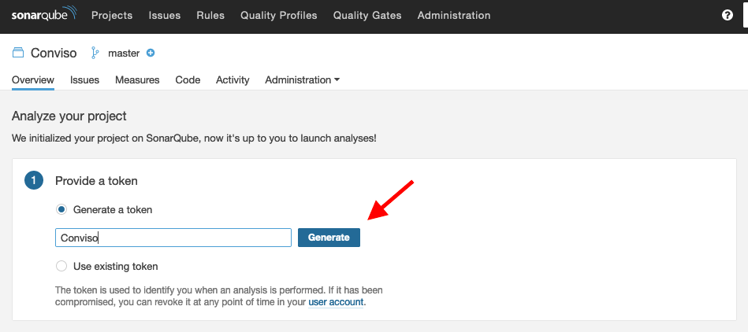
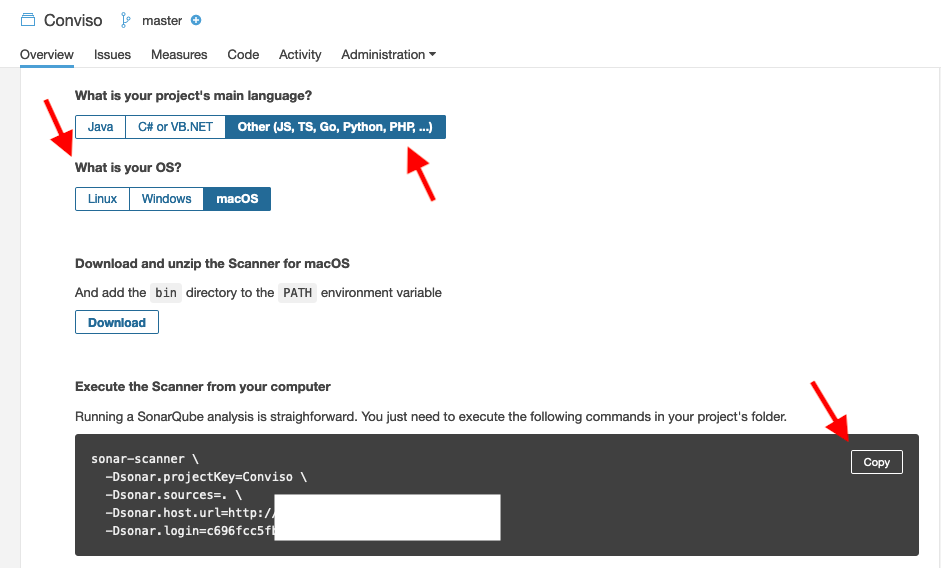
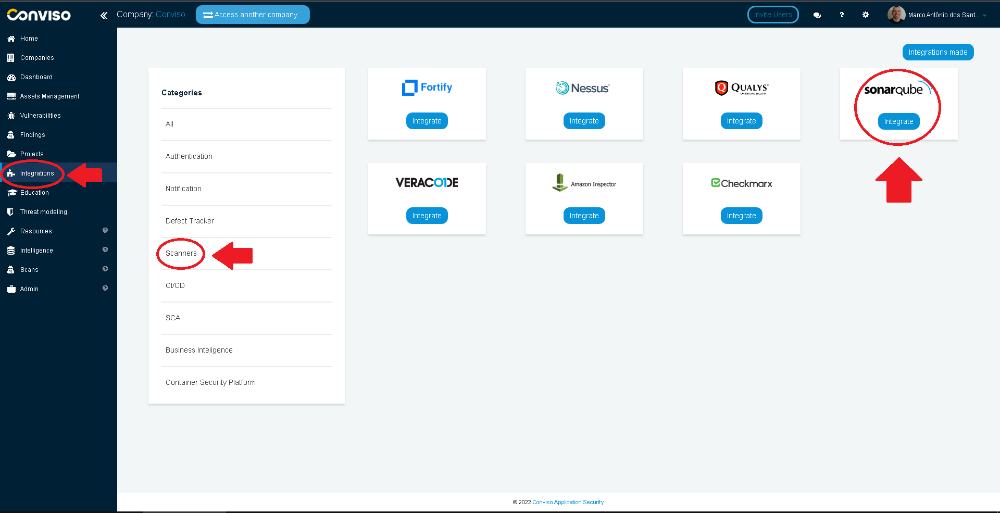
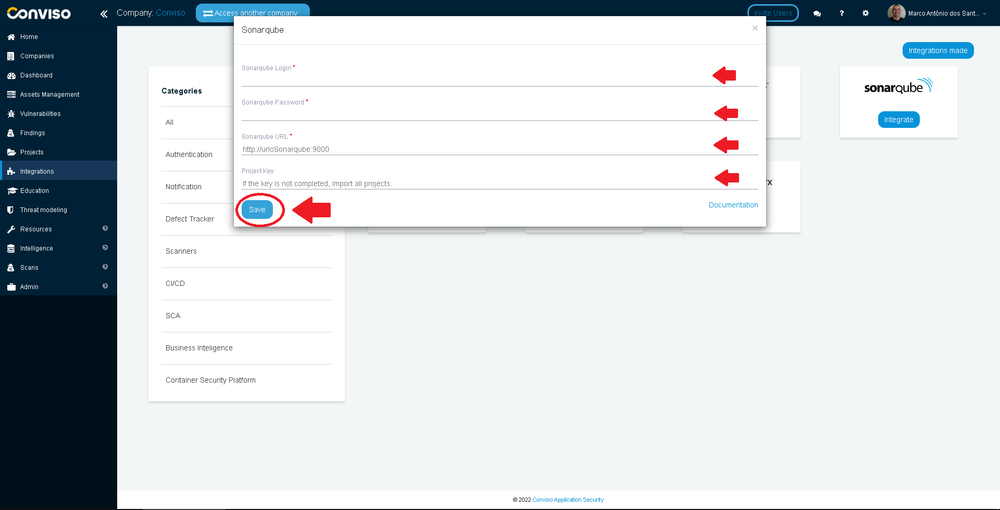
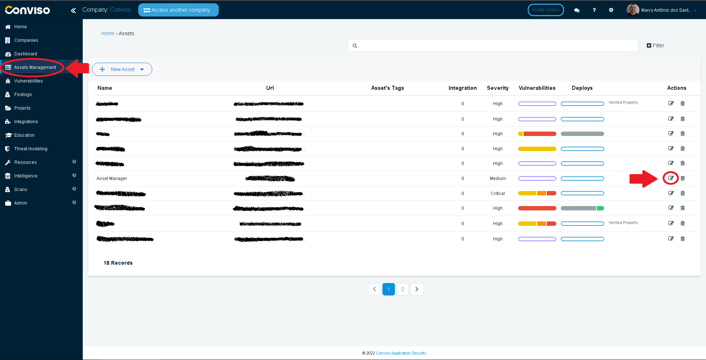
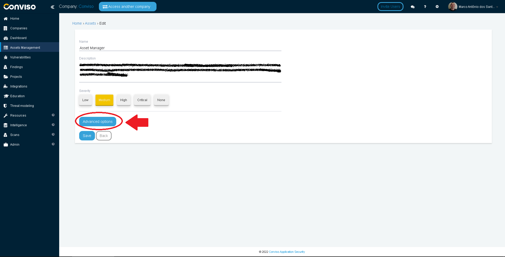
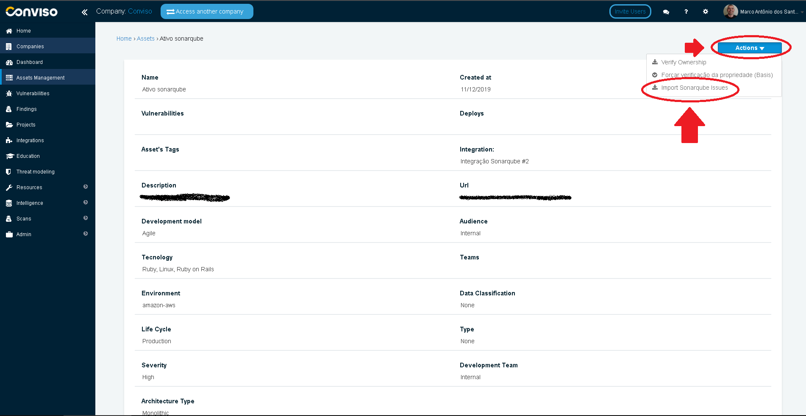

<div style={{textAlign: 'center'}}>


</div>

:::note
First time using SonarQube? Please refer to the [following documentation](https://docs.sonarqube.org/latest/)
:::

## Introduction

Consolidate vulnerabilities: From a single console you can consolidate and apply analysis of vulnerabilities identified by scan, develop action plans for the treatment of vulnerabilities.

The integration allows the import of issues (vulnerabilities) found in SonarQube to Conviso Platform, allowing the user to take advantage of Conviso Platform full potential for vulnerability management.

## Requirements

- SonarQube Username;

- SonarQube Password;

- SonarQube URL;

- Project Key (optional).

## Configuring SonarQube

Login to SonarQube. Please write down the SonarQube **URL**, **Username** and **Password**;

From the top menu bar, select **Projects** and create a **New Project**. Label the **Project Key** with a unique name (remember to write down this key, you will need it later), label the **Display Name** as you wish and then click on the **Set Up** button:

<div style={{textAlign: 'center'}}>


</div>

Label your new token as you wish and then click on the **Generate** button to create it:

<div style={{textAlign: 'center'}}>



</div>

Choose your **Language**, **OS** type and then click on the **Copy** button at the text box labeled **Execute the Scanner from your computer**:

<div style={{textAlign: 'center'}}>



</div>

## Conviso Platform Setup

Log in to the [Conviso Platform](https://app.convisoappsec.com);

On the main menu to the left, click on **Integrations**. At the panel to the right, click on the **Scanners** option, then click on the **Integrate** button on the **SonarQube** card:

<div style={{textAlign: 'center'}}>



</div>

Fill the form with the data retrieved from SonarQube. Note that if you not fill the **Project Key**, all of your SonarQube Projects will be imported to Conviso Platform. When done, click on the **Save** button to store your integration configuration settings:

<div style={{textAlign: 'center'}}>



</div>

## Connecting Conviso Platform Assets to SonarQube

On the main menu to the left, click on **Assets Management**. Then, on the asset you want to integrate with SonarQube, select the **Edit** icon to its right: 

<div style={{textAlign: 'center'}}>



</div>

Click on the **Advanced Options** button to expand the asset's properties:

<div style={{textAlign: 'center'}}>



</div>

On the **Integrations** section of the asset's properties, type ```SONAR``` to narrow your search and then select the SonarQube integration you just created in the preceding section:

<div style={{textAlign: 'center'}}>


</div>

After selecting the SonarQube Integration for your asset, scroll down to the end of the form and click on the **Save** button, to store your new configuration settings for the asset:

<div style={{textAlign: 'center'}}>


</div>

## Importing SonarQube Issues

On the **Assets Management**, click on the asset you want to import issues from SonarQube:

<div style={{textAlign: 'center'}}>


</div>

On the asset panel, click on the **Actions** button, then select **Import SonarQube Issues**:

<div style={{textAlign: 'center'}}>



</div>

The imported issues will be found on the **Findings** Menu.