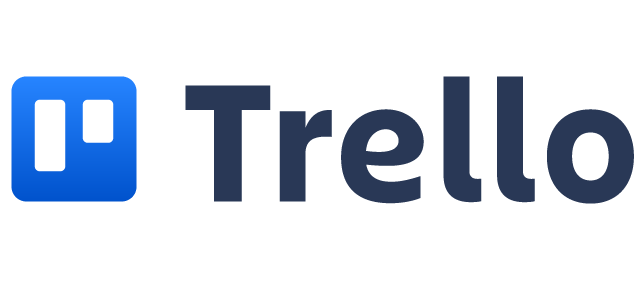
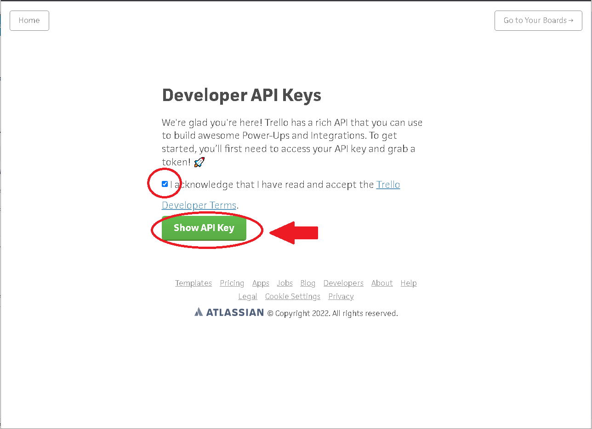
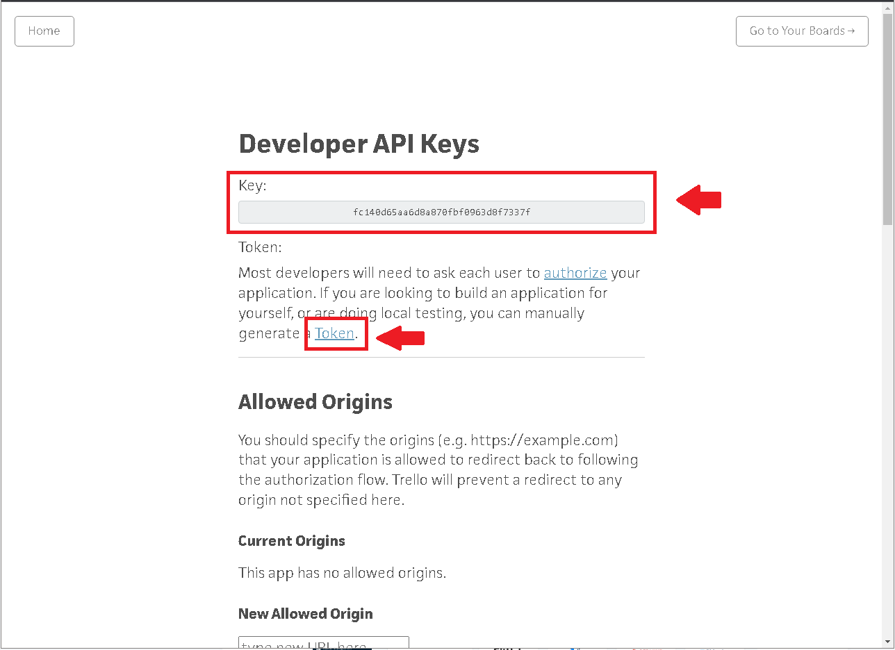
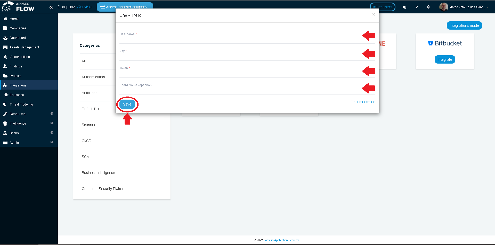
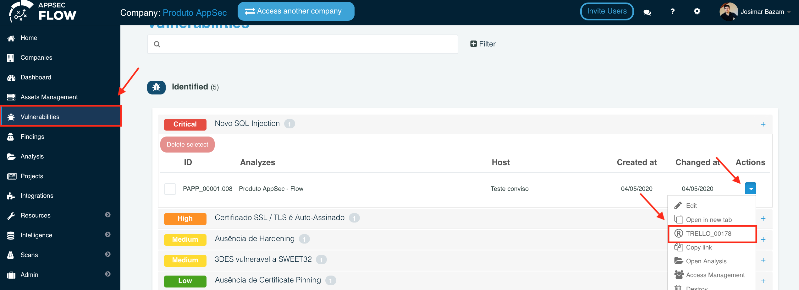
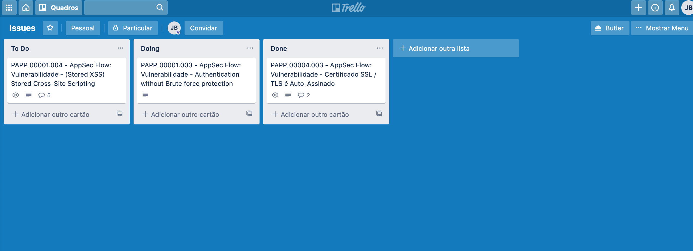

<div style={{textAlign: 'center'}}>



</div>

## Introduction

The integration of Conviso Platform with Trello is done through an **API**, where we connect our product with Trello, which allows the creation of issues, comments, and as well as a webhook for comments made in an issue.

Trello's integration with Conviso Platform will benefit issue control management and vulnerability consolidation. With the integration performed, the customer can orchestrate vulnerability to Trello's Board.

Conviso Platform and Trello have a two-way communication, that is, if a user adds comments in the Trello discussion field, the added message will automatically appear in the Security Champions tab of the vulnerability. This allows a Conviso technician to interact with the development team that is making corrections.

## Requirements

In order to perform the integration, we will need 4 pieces of information:

- Username used in Trello;

- API Key;

- Token;

- Board (optional).

## Configuring Trello integration

Log in to Trello using your Atlassian account. Next, click on your user icon at the right of the top menu bar and choose **Profile and visibility** under you account settings and copy your current username and store it in a text file, to easily recover it later, as shown in the following example:

<div style={{textAlign: 'center'}}>


</div>

Next, while still logged in, open this link at [Trello](https://trello.com/app-key/). Read and accept the Trello Developer Terms and click on the **Show API Key** button:

<div style={{textAlign: 'center'}}>



</div>

Copy and save the obtained API Key in text file, to easily recover it later. Then, click at the **Token** link: 

<div style={{textAlign: 'center'}}>



</div>

Authorize the application access to your account, by clicking the **Allow** button at the end of the form:

<div style={{textAlign: 'center'}}>


</div>

Copy and save the obtained token in a text file, to easily recover it later. You may now close the Token window:

<div style={{textAlign: 'center'}}>


</div>

Once we already get all the required information, it is time to move on to Conviso Platform. Log in to Conviso Platform, go to **Integrations** on the left menu, choose **Defect Tracker** from the right panel and then click on the **Integrate** button on the Trello card:

<div style={{textAlign: 'center'}}>


</div>

At the floating window, insert the datum required that were previously obtained. When finished, click at the **Save** button to store your integration settings:

<div style={{textAlign: 'center'}}>



</div>

After saving the integration, we need to associate one or more assets with the Trello integration. Go to **Assets Management**, identify the asset that should be associated in the integration and click on edit icon to the right, as shown in the following example:

<div style={{textAlign: 'center'}}>


</div>

In the opened window, look for the field **Integrations**. Type ```Trello``` to search for the Trello integration, select it and then click on the **Save** button:

<div style={{textAlign: 'center'}}>


</div>

To finish the integration, let's create an issue in Trello's Board. Go to the **Vulnerabilities** menu, click on the drop-down list under **Actions** and click on the integration name "Trello", as shown below:

<div style={{textAlign: 'center'}}>



</div>

To check it out if everything is working, visit the Trello Board:

<div style={{textAlign: 'center'}}>



</div>