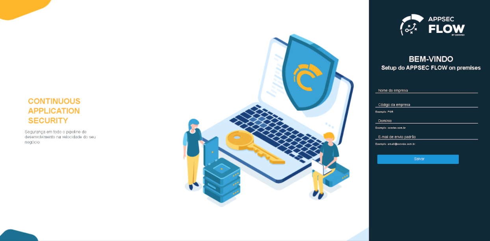

Once all AppSec Flow components are up, running and healthy, you can access AppSec Flow web application at ```https://DOCKER_HOST_IP_ADDRESS```



## Company Information

At this point, you must provide essential information as:
- **Company Name**
- **Company ID**
- **Company Domain**
- **AppSec Flow Sender E-mail Address**

Click at “Salvar” to continue, once you have completed filling this form.

## License

Next, you should ask Conviso for a new License Key. Like obtaining AppSec Flow Access Token, you must e-mail sre@convisoappsec.com and ask for a new AppSec Flow On Premises License.

Paste the License string and click at button “Salvar” to continue


## SMTP Configuration

:::note
This step can be configured later.
:::

Now, you need to set up a SMTP mail server that AppSec Flow can use.
If you do not know what configuration to input here, ask for your Infrastructure Support Team to provide you with proper data to use here.
You’ll be asked for:

- **E-mail User**
- **E-mail Password**
- **E-mail Domain**
- **SMTP Server Address**
- **SMTP Server Port**

After filling up the form, click at button “Salvar” to continue.

## Creating an admin user

The next step will set up a new administrator user at AppSec Flow.
Fill the form with the required info:

- **User Name**
- **User E-mail**
- **User Password**
- **User Password Confirmation**

Make sure you’ll remember those info, they will be used to login and finish AppSec Flow initial installation.

Note that, if you continue beyond this point, you are agreeing to Conviso’s Software License Terms and Conditions. Make sure that you have read, understood and agreed to it.

Once you are ready, click at button “Salvar”.

